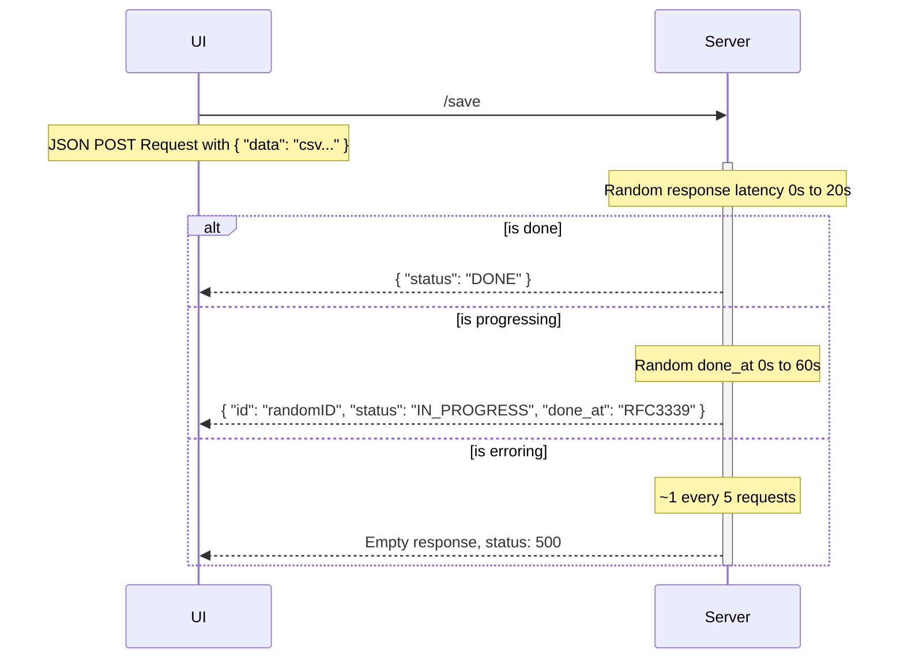

# API

## Facts

- The API doesn't actually save anything, the code discards the data you send it. So don't expect to be able to retreive that data again.
- There's only two endpoints `/save` and `/get-status`.
- Saving a spreadsheet requires you to use both endpoints in most cases.

## How it works

The frontend will make a POST json request to `/save` passing data like this

```
{
  "data": "csv..."
}
```

The server will do the following:

- Generate a random timestamp for when "processing" is expected to be done

You use this in the UI to figure out when to hit `/get-status` to inquire if processing has been
completed or not

- Generate a random ID

Very important, because if the server generates a random timestamp higher than "now" you'll need
to use the ID returned to check for the status

- Generate a random response latency

The server will act as though it's under load and will artifically slow down

- Error out roughly every 1 out of 5 requests

Returning an empty response with error code 500



## Endpoints

---

### `**POST**` `/save`

**Input**

```
{
  "data": "csv..."
}
```

**Output**

> _random done_at_ timestamp is `0s`

_status_code_: 200

```
{
  "status": "DONE"
}
```

> _random done_at_ timestamp is `> 0s`

_status_code_: 200

```
{
  "id": "randomID",
  "status": "IN_PROGRESS",
  "done_at": "timestamp in RFC3339 format"
}
```

> ~1 out of 5 requests

_status_code_: 500

_body_: empty

---

### `**GET**` `/get-status?id=???`

> _random done_at_ timestamp is `0s`

_status_code_: 200

```
{
  "status": "DONE"
}
```

> _random done_at_ timestamp is `> 0s`

_status_code_: 200

```
{
  "id": "randomID",
  "status": "IN_PROGRESS",
  "done_at": "timestamp in RFC3339 format"
}
```

---

## Ranges & Limits

- No rate limits

### Random Response Latency Range: 0s to 20s

### Random done_at Range: 0s to 60s
